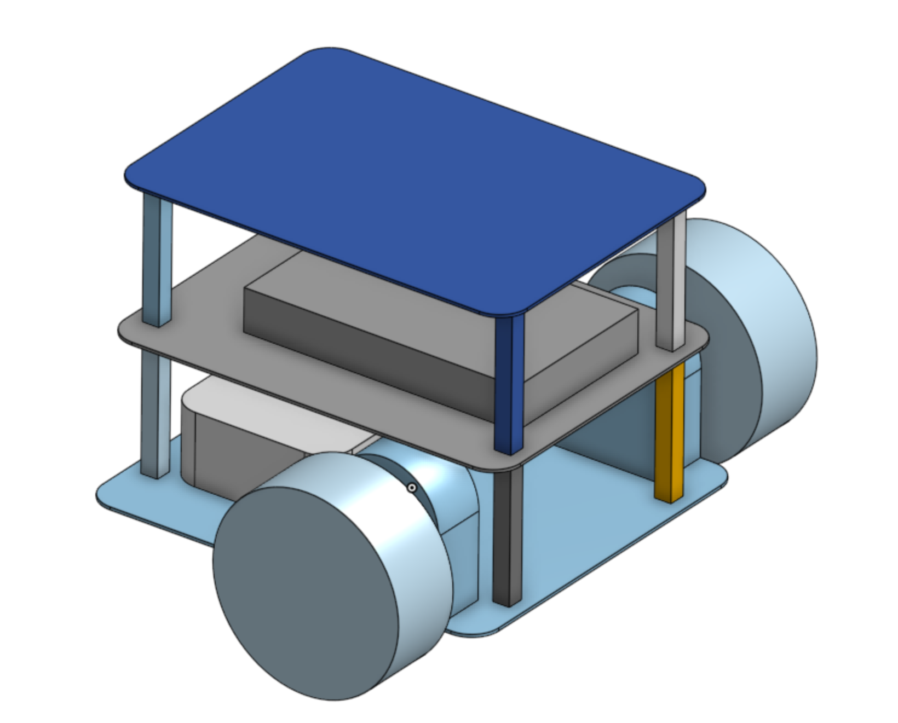

# pinklab_minibot_robot
PinkLab MiniBot ROS2 Packages



## Install

### Build from sources

```shell
$ cd ~/dev_ws/src
$ git clone https://github.com/byeongkyu/pinklab_minibot_robot.git
$ rosdep install --from-paths src --ignore-src -r -y

$ colcon build --symlink-install
```


## Execute

### Gazebo Simulation

```shell
$ ros2 launch minibot_bringup bringup_robot_gazebo.launch.py world_name:=simple_building.world
```

### Real robot

``` shell
$ ros2 launch minibot_bringup bringup_robot.launch
```
